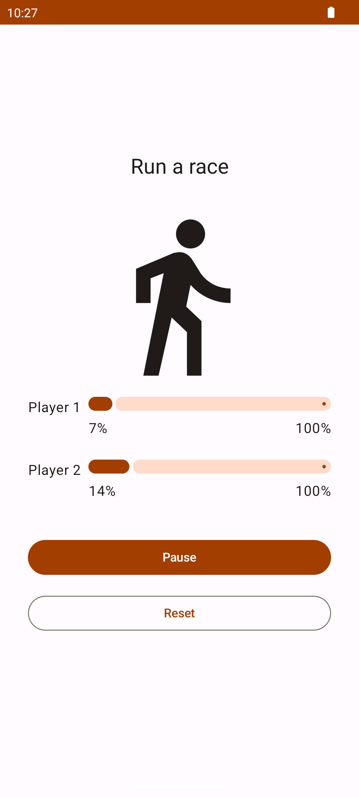

# 🏁 Race Tracker App

A simple Android app built with Jetpack Compose that simulates a race between two participants. Each player progresses over time using Kotlin Coroutines, and their status is displayed with progress bars. The race can be started, paused, and reset through an intuitive UI.

---

## 🚀 Key Features

**Real-time race simulation using Jetpack Compose + Coroutines with pause, resume, and reset controls.**

---

## 📸 Screenshot

## 📂 Project Structure

- `RaceParticipant.kt` – Holds the race logic for each player (progress tracking, coroutine-based race run, and reset).
- `RaceTrackerApp.kt` – Composables to build the UI, handle state, and manage user interaction.
- `RaceParticipantTest.kt` – Unit tests covering race behavior: start, pause, resume, completion, and validation.

---

## 🧪 Technologies Used

- **Jetpack Compose**
- **Kotlin Coroutines**
- **Mutable State Handling** (`remember`, `mutableStateOf`)
- **JUnit** for testing

---

## 🧠 How It Works

- Each `RaceParticipant` has an independent coroutine updating its progress.
- `LaunchedEffect` is used to start the race only when toggled.
- UI reflects progress using `LinearProgressIndicator`s.
- Controls allow the user to **start**, **pause**, or **reset** the race.
- Test suite verifies proper state handling and race logic.
