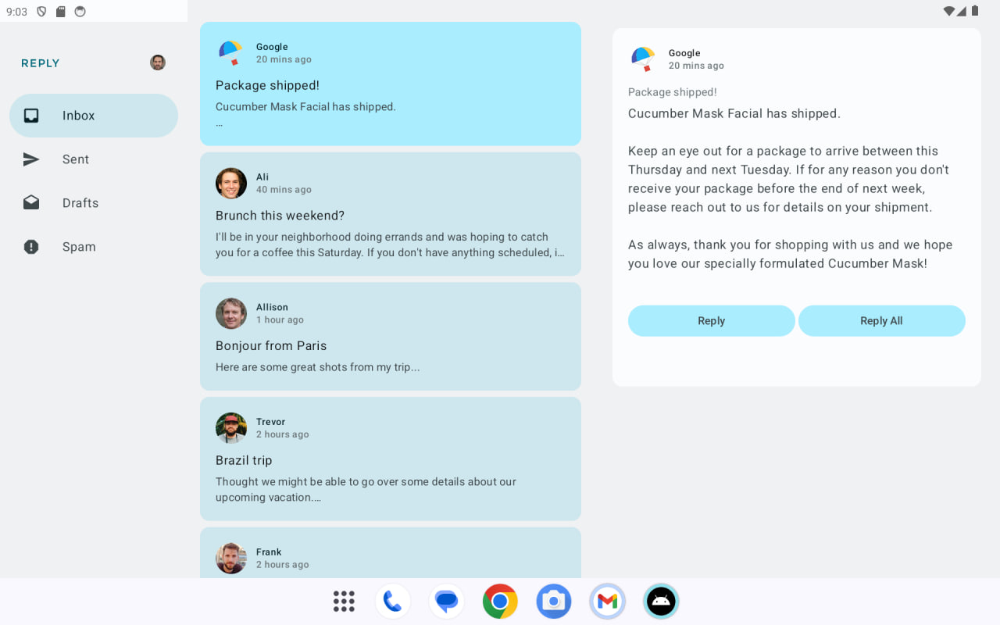
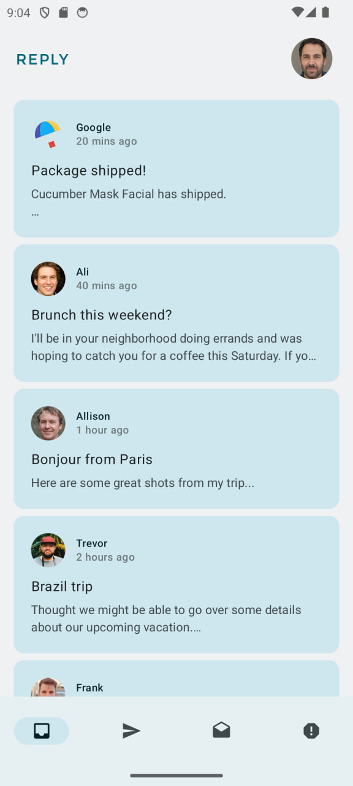
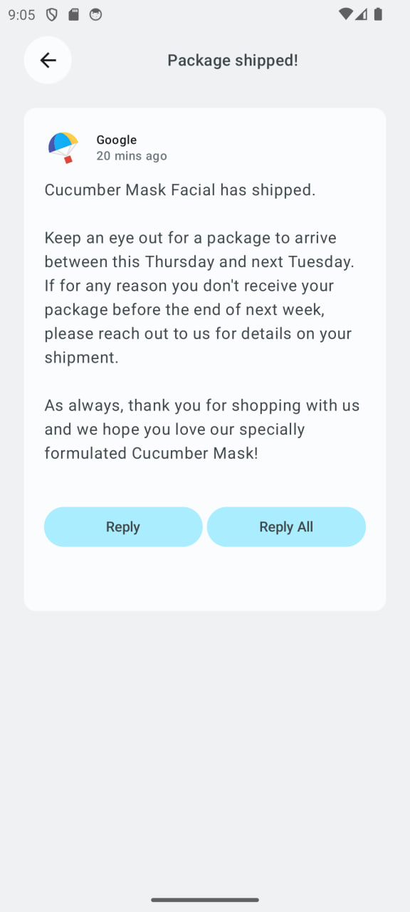

# 📫 Reply App – Android Basics with Compose

A responsive email client app demonstrating **adaptive layouts**, **navigation patterns**, and **UI testing** using **Jetpack Compose**.

---

## ✨ Features

- Adaptive UI using [Window Size Classes](https://developer.android.com/guide/topics/large-screens/support-different-screen-sizes)
- Responsive navigation:
  - Bottom Navigation (Compact)
  - Navigation Rail (Medium)
  - Permanent Drawer (Expanded)
- Two-pane layout support (List + Detail)
- Built with Material 3 components
- State restoration across configuration changes
- Compose UI testing using semantic tags

---

## 🖼️ Screenshots

  
  
  

## 🚀 Getting Started

1. Install [Android Studio](https://developer.android.com/studio) (latest stable version).
2. Clone or download this repository.
3. Open the project in Android Studio.
4. Build and run on an emulator or physical device.

---

## 📚 Prerequisites

- Basic knowledge of Kotlin
- Creating and using composable functions
- Understanding of Compose navigation
- Ability to create and run Android projects in Android Studio

---

## 📦 Starter Code Source

This is part of the [Android Basics with Compose](https://developer.android.com/courses/android-basics-compose/course) course by Google.

