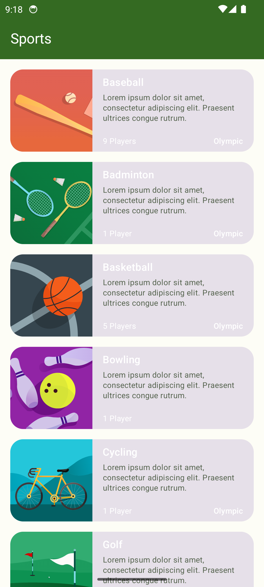
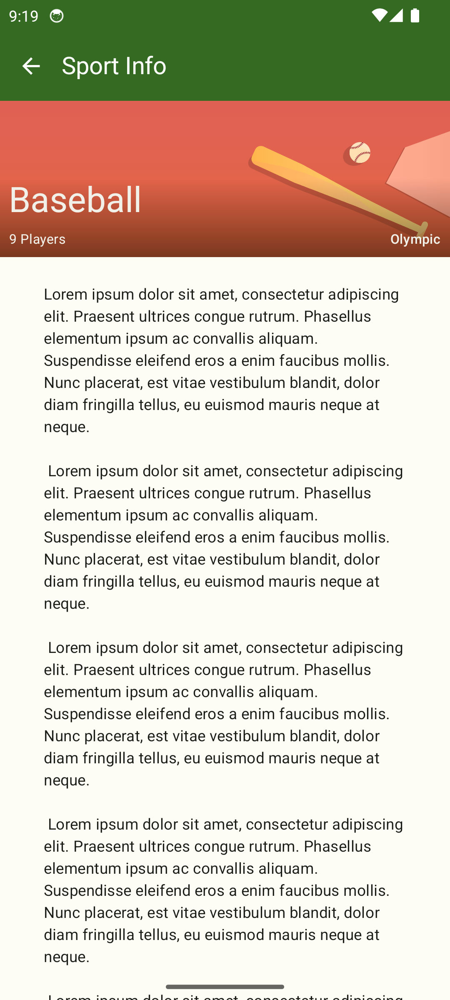
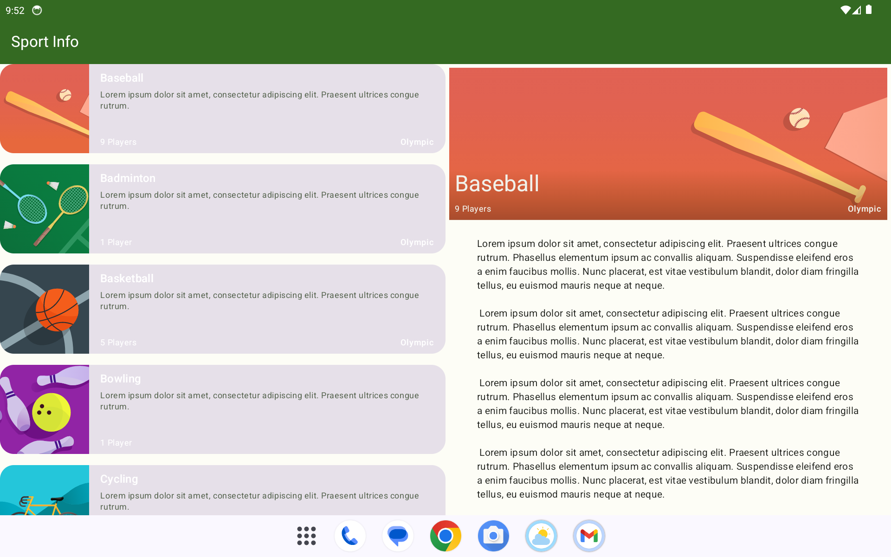

# 🏀 Sports App – Adaptive Layout with Jetpack Compose

This project is a practice implementation based on the **Android Basics with Compose** pathway. The goal is to make the Sports app adaptive across different screen sizes using **WindowSizeClass** and a **canonical layout** approach.

---

## 📱 What is the Sports App?

The Sports App is a simple Jetpack Compose-based app that displays a list of sports and shows details about each one. The base app is already designed for compact (mobile) screens. This project enhances it to support **large and expanded screen sizes** (like tablets or foldables) using **side-by-side layouts**.

---

## 🧠 What You’ll Learn

✅ Use `WindowWidthSizeClass` to detect screen size  
✅ Build adaptive layouts using **canonical design patterns**  
✅ Design and implement a **List-Detail layout** for large screens  
✅ Use Compose Navigation appropriately for different screen sizes  
✅ Manage state and back stack behavior effectively

---

## 📂 Features

- 🔁 Responsive layout: Compact (single-pane) and Expanded (list-detail)
- 🧱 Canonical layout design for large screens
- 📐 Uses `Material3:WindowSizeClass` for layout decisions
- 🧭 Compose Navigation with proper back behavior
- 🎯 Preview support for the expanded layout
- ⚙️ Clean, scalable structure using composables

---

## 🔧 Prerequisites

- Kotlin & Jetpack Compose basics
- Android Studio installed
- Completed these codelabs:
    - *Build an adaptive app with dynamic navigation*
    - *Build an adaptive app with adaptive layout*

---

## 🖼️ Screenshots

